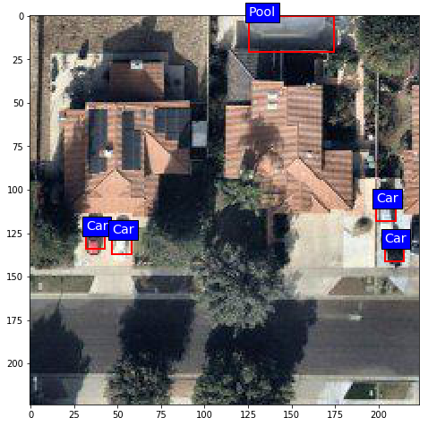
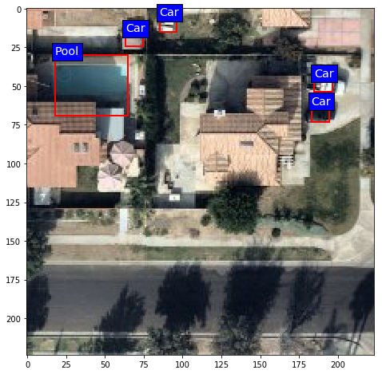

# Detecting Cars and swimming pool using Faster RCNN based on Resnet101

This is fundamentally an Object detection problem, where the deep learning model not alone needs to classify the type of object in the image, but also localize the object on the image.
The three most popular architectures for object detection, in terms of increasing accuracy and decreasing inference time, are:
* Faster RCNN
* Single Shot Detectors (SSD)
* You only look once (YOLO)

Owing the limited dataset, I decided to leverage **Tensorflow's Object Detection API**. To solve the given problem, I trained 
* SSD based on MoblieNet V1 locally, and
* Faster RCNN based on Resnet101 on Google Cloud  ML engine

This document and submission will a walkthrough of the solution using the **Faster RCNN**.

**NOTE**: All the *gcloud* and *gsutil* commands metioned here needs to be executed with Google Cloud SDK in the shell.

## First look at the data & TFRecord generation

In the Jupyter Notebook **dipping_the_toe.ipynb** I have,
* setup the directory structure required for the training
* parsed the xmls to obtain bounding boxes
* visualized the bounding boxes on the train images
* split the dataset into train and validation sets
* created TFRecords of the train and validation sets

## Training

The following are the list of steps performed for the training:
1. Git cloned the [Tensorflow model](https://github.com/tensorflow/models) repo
2. Ran the setup in the models/research and models/research/slim
  * `python setup.py sdist`
  * `cd slim`
  * `python setup.py sdist`
3. Moved both the distributions to the directory api within the working directory
4. [Faster RCNN based on Resnet101 and pretrained on coco](http://download.tensorflow.org/models/object_detection/faster_rcnn_resnet101_coco_2018_01_28.tar.gz) was downloaded, extracted into the *pre-trained-model* directory. 
5. *pipline.config* file was altered to point to the tfrecords and number of classes. 
6. The model checkpoints(model-ckpt*) and the pipeline.config file was uploaded to Google storage.
  * `gsutil cp pre-trained_model/faster_rcnn_resnet101/model-ckpt* gs://BUCKET_NAME/model`
  * `gsutil cp pre-trained_model/faster_rcnn_resnet101/pipeline.config gs://BUCKET_NAME/model`
7. Upload the TFRecord files to the Google storage
  * `gsutil cp images/train.record gs://BUCKET_NAME/data`
  * `gsutil cp images/validation.record gs://BUCKET_NAME/data`
8. Submit training job
``` shell
      gcloud ml-engine jobs submit training JOB_NAME \
        --job-dir=gs://BUCKET_NAME/train \
        --packages api/object_detection-0.1.tar.gz,api/slim-0.1.tar.gz \
        --module-name object_detection.train \
        --region us-central1 \
        --config api/cloud.yml \
        -- \
        --train_dir=gs://BUCKET_NAME/train \
        --pipeline_config_path=gs://BUCKET_NAME/data/pipeline.config```

Training was performed for 5000 steps 

## Prediction

#### Export the inference graph
Once the training is complete, download the *model.ckpt* files to your local directory.

`gsutil cp gs://BUCKET_NAME/train/model-ckpt* post_training/`

Extract the inferance graph by using the export_inference_graph.py in the Tensorflow Object detection API
```shell
python models/research/object_detection/export_inference_graph.py \
    --input_type encoded_image_string_tensor \
    --pipeline_config_path pre-trained_model/faster_rcnn_resnet101/pipeline.config \
    --trained_checkpoint_prefix post_training/model.ckpt-5000 \
    --output_directory export_model/
```


#### Deploy the model in Cloud ML Engine
Upload the inferance graph

`gsutil cp -r export_model/saved_model/ gs://BUCKET_NAME/tmp_dir/`

Setup the model with version

`gcloud ml-engine models create MODEL_NAME --regions us-central1`

`gcloud ml-engine versions create VERSION_1 --model MODEL_NAME --origin=gs://BUCKET_NAME/tmp_dir/saved_model --runtime-version=1.2`
`

#### Predict
Execute *predict.py* to perform online prediction for all the images in the test_data_images directory

`python predict.py`

## Results

 

## Prerequisites

The following are the packages required to run the above.
* Tensorflow 1.9
* Tensorflow models
* Google API client
* Google Cloud SDK
